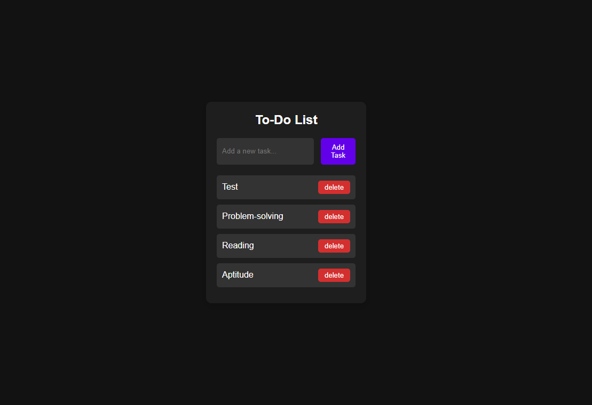

# todo-localstorage

A responsive To-Do application built with vanilla JavaScript that leverages browser Local Storage to persist user data.

# To-Do List with Local Storage

This is a dynamic, client-side To-Do List application built with vanilla JavaScript, HTML, and CSS. It allows users to create a list of tasks and manage them effectively. The project demonstrates core front-end development principles, including DOM manipulation and data persistence.

## Screenshot

## Core Functionality

The main feature of this application is its ability to remember tasks. By utilizing the browser's **Local Storage**, all to-do items are saved and retrieved across browsing sessions, ensuring that user data is not lost upon closing the tab.

Key features include:

- **Task Creation:** A user-friendly input field to seamlessly add new tasks to the list.
- **Task Deletion:** An option to permanently remove tasks from the list.
- **Persistent State:** Your task list remains exactly as you left it, providing a consistent user experience.

## Tech Stack

This project was built from the ground up using:

- **JavaScript:** For all logic, DOM manipulation, and interaction with Local Storage.
- **HTML5:** For the structure and content of the application.
- **CSS3:** For all styling, layout, and responsive design.

## Contributing

Contributions are what make the open-source community such an amazing place to learn, inspire, and create. Any contributions you make are **greatly appreciated**.

If you have a suggestion that would make this better, please fork the repo and create a pull request. You can also simply open an issue with the tag "enhancement". Don't forget to give the project a star! Thanks again!

1.  Fork the Project
2.  Create your Feature Branch (`git checkout -b feature/AmazingFeature`)
3.  Commit your Changes (`git commit -m 'Add some AmazingFeature'`)
4.  Push to the Branch (`git push origin feature/AmazingFeature`)
5.  Open a Pull Request
